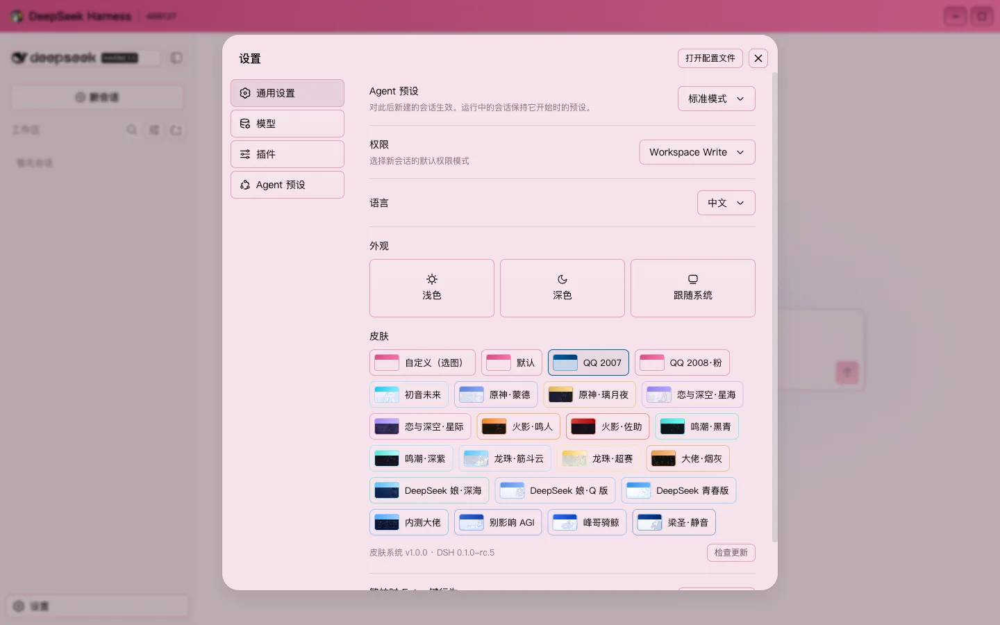
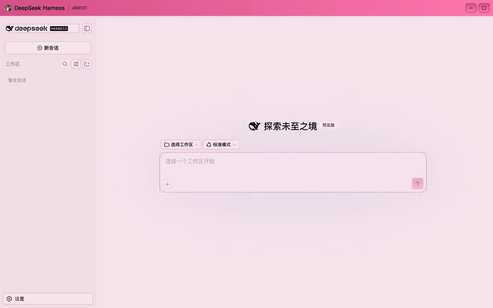
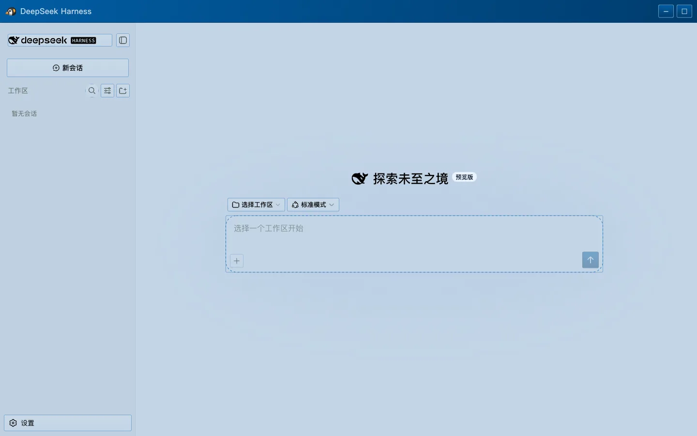
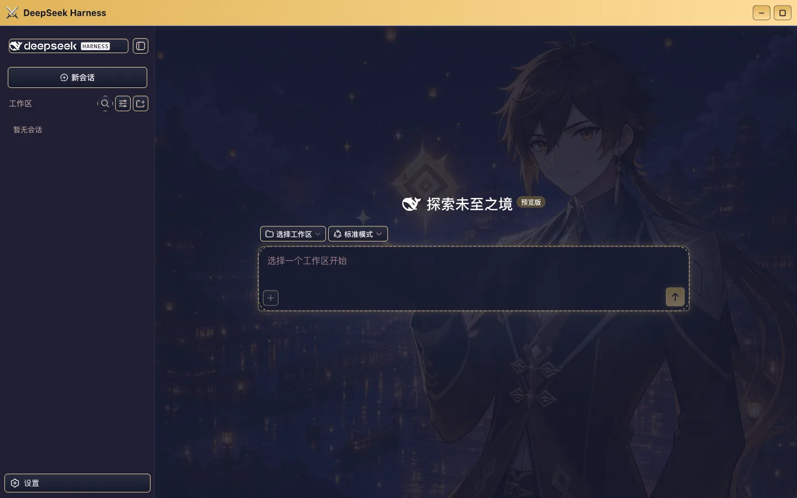
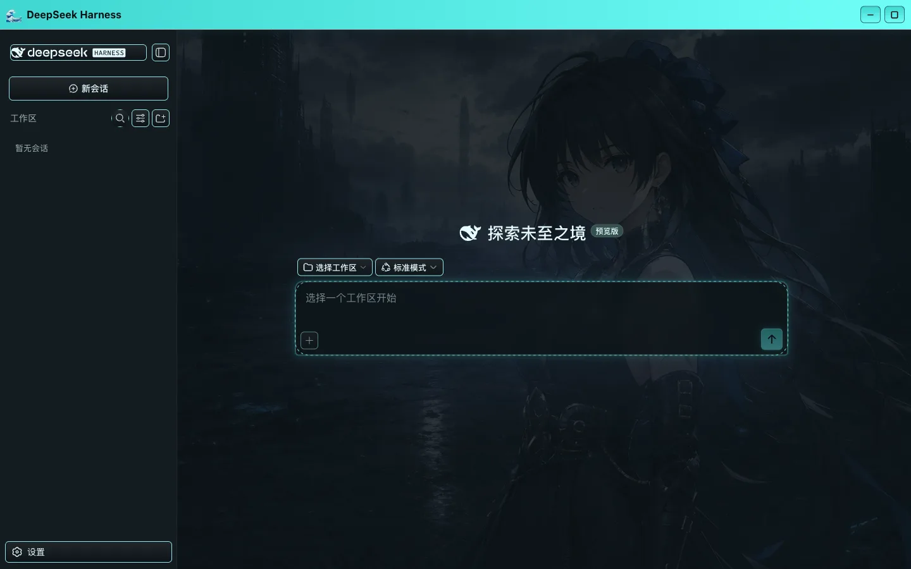
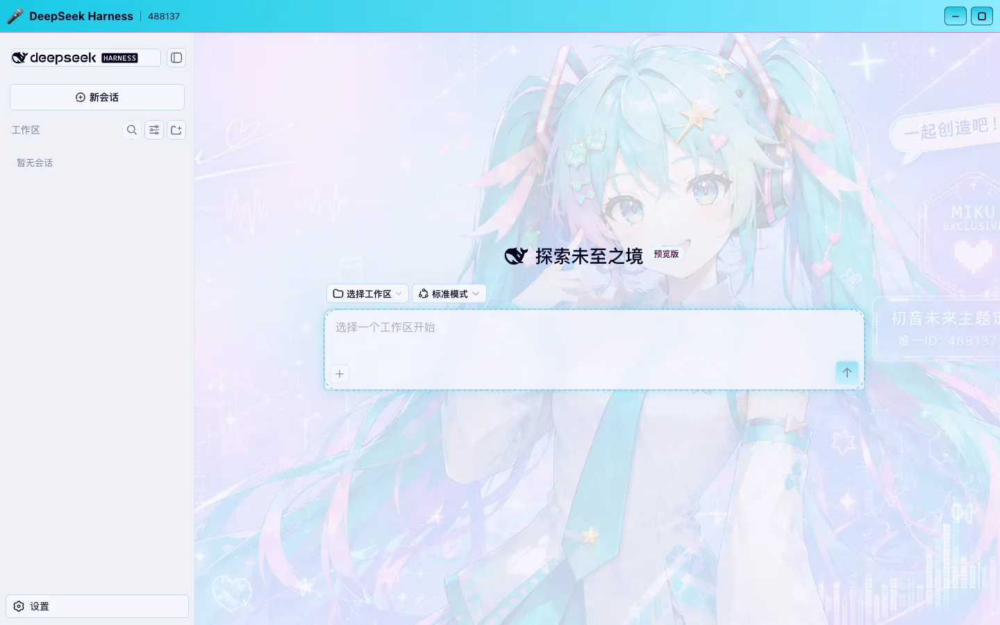
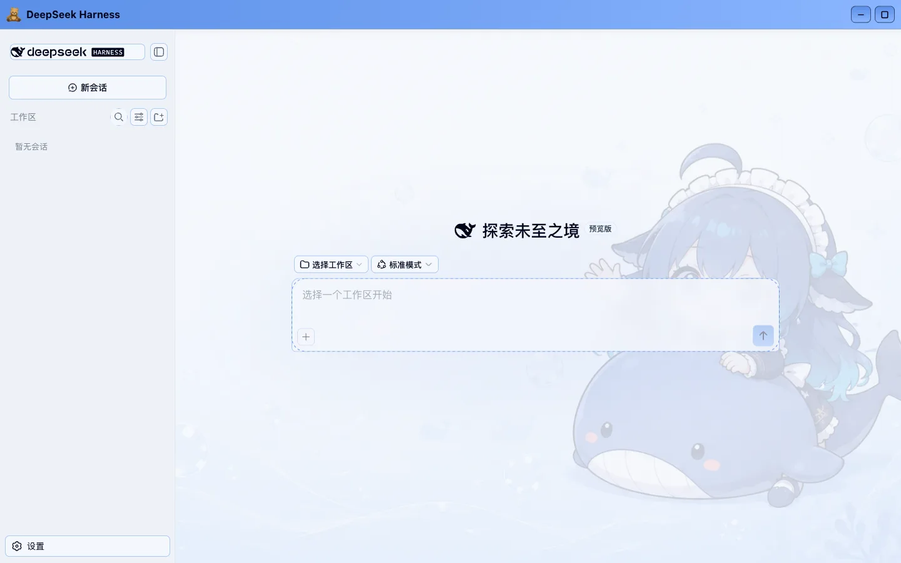
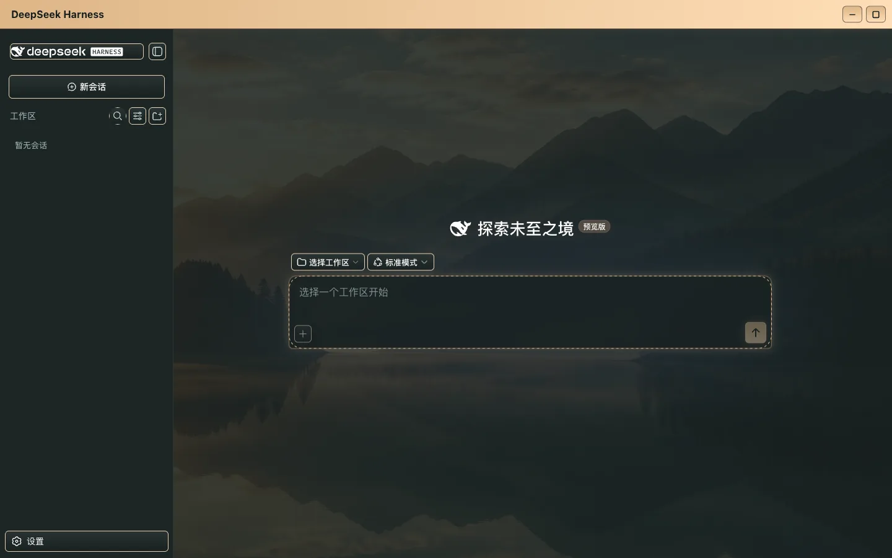

# DeepSeek Harness Skin

<div align="center">

**The place you run agents should look the way you like.**

21 built-in skins plus a one-image custom theme pipeline. Installs into a DeepSeek Harness source checkout; switching skins is a single click in Settings, and the stock look is always one click away.

[](LICENSE)


[Quick start](#quick-start) · [Screenshots](#screenshots) · [Make your own](#make-a-skin-from-one-image) · [How it works](#how-it-works) · [中文](README.md)

Built by [HeiGeAi](https://github.com/HeiGeAi) · More projects at the [HeiGeAi org page](https://github.com/HeiGeAi)

</div>



*Live screenshot: the skin section of the Settings panel. "Custom (pick an image)" is always first, every chip is a real thumbnail of that skin, and the bar underneath shows the skin-system version, the host version, and a "Check for updates" button.*

## Screenshots

All live screenshots. The sidebar, composer, and session list are stock DSH controls and stay fully functional.

| QQ 2008 Pink | QQ 2007 |
| --- | --- |
|  |  |

| Genshin Night | Wuthering Tide |
| --- | --- |
|  |  |

| Hatsune Miku | DeepSeek-tan Q |
| --- | --- |
|  |  |

## Quick start

Requirements: a [deepseek-harness](https://github.com/deepseek-ai/deepseek-harness) source checkout at `0.1.0-rc.5`, Node.js 22.19 or newer, and pnpm. Running DSH straight from npm (`npx @deepseek-ai/dsh`) will not work, because these skins are compiled together with the frontend.

```bash
git clone https://github.com/HeiGeAi/deepseek-harness-skin.git
cd deepseek-harness-skin
bash scripts/install.sh /path/to/deepseek-harness
```

The installer backs up every file it is about to touch into `~/.dsh-skin-backups/<timestamp>/`, writes the skin package, and applies an 8-file host-integration patch. Then rebuild:

```bash
cd /path/to/deepseek-harness && pnpm install && pnpm run build && pnpm dsh web
```

Open `http://127.0.0.1:3080` and go to **Settings → General → Skin**.

To revert:

```bash
bash scripts/uninstall.sh /path/to/deepseek-harness
```

## Make a skin from one image

Pick "Custom (pick an image)" — the first entry in the picker — and choose any PNG, JPG, or WebP. Everything else is automatic:

1. The browser decodes the picture once, samples it at 96px for colour, and re-encodes it at 1920px on the long edge as WebP.
2. Four seed colours (accent, secondary, surface, text) are extracted, and the picture is classified as light or dark.
3. Veil opacity is tuned against the image's own extremes so text stays readable on any picture.
4. The image is stored content-addressed under `~/.dsh/skins/` and served by a read-only Host route.

**The original never leaves your machine.** The upload goes to the DSH Host running on the same box; only the compressed WebP is stored, and re-picking the same picture never stores it twice.



## Built-in skins

21 presets: QQ 2007, QQ 2008 Pink, Hatsune Miku, Genshin Dawn, Genshin Night, Deepspace Star, Deepspace Nebula, Naruto, Sasuke, Wuthering Tide, Wuthering Echo, Dragon Ball Nimbus, Super Saiyan, Dalao Smoke, DeepSeek-tan Deep Sea, DeepSeek-tan Q, DeepSeek Youth, Beta Tester, Don't Disturb the AGI, Feng Ge, and Liang Sheng.

QQ 2007 and QQ 2008 ship **no bitmap at all** — the whole interface is derived at build time from four seed colours. The other 19 each carry one background image.

## How it works

One skin equals one JSON file:

```json
{
  "id": "qq-2008",
  "name": { "zh": "QQ 2008·粉", "en": "QQ 2008 Pink" },
  "order": 20,
  "appearance": "light",
  "chrome": "glass",
  "seeds": {
    "accent": "#c8447e",
    "secondary": "#d98bb0",
    "surface": "#f6e2ec",
    "text": "#2b1020"
  },
  "glyph": "🐧",
  "showBadge": true
}
```

Four design decisions around that file:

**Contrast-preserving derivation.** DSH ships 73 absolute colour steps and 89 semantic aliases. When the generator derives a full ramp from four seeds, it preserves each step's contrast relationship with the stock palette, so the hierarchy between buttons, borders, and disabled states survives. The math runs in OKLab, and out-of-gamut colours are fitted back into sRGB by chroma bisection.

**Readability is checked deterministically at build time.** 21 skins × 8 contrast contracts run on every build, and a failure breaks the build. Reproduce it with:

```bash
pnpm --filter @deepseek-ai/dsh-client-ui-theme run check:skins
```

**Scoping is closed at the body attribute.** Every rule lives under `body[data-dsh-skin="<id>"]` and `body[data-skin-chrome="<flat|glass|neon>"]`. No global CSS variable is touched, so removing the attribute restores the stock look instantly with nothing left behind.

**The background layer is pinned to the viewport.** It sits in its own fixed layer instead of scaling with the session container, so opening a conversation or scrolling a long thread never moves it.

To add your own skin, drop a JSON file into `src/styles/skins/themes/` and run `pnpm --filter @deepseek-ai/dsh-client-ui-theme run build:skins`.

## Version and update check

The Settings panel shows `Skin system v1.0.0 · DSH 0.1.0-rc.5` with a "Check for updates" button. The request is **proxied through the DSH Host** rather than issued by the browser: 3-second timeout, 64KB response cap, 60-second cache. When the network is unavailable it reports so and stays clickable.

## Notes, honestly

- This is a **source-level change**: the installer overwrites `packages/client/ui-theme` and applies an 8-file patch, so a `pnpm run build` is required. Nothing is injected at runtime and no process is hijacked.
- The baseline is `0.1.0-rc.5`. DSH is still in developer preview, so upstream UI changes may break the patch; the installer fails loudly instead of half-installing.
- After installation the full DSH suite still passes: 811 test files, 13548 tests, 100% coverage across statements, branches, functions, and lines, with per-file thresholds.
- Custom skins stay local. Compressed images live in `~/.dsh/skins/`; the uninstaller leaves them alone.
- The upload route validates the WebP magic bytes and cuts off any request past 4MB instead of buffering it.

## License and assets

Code is [MIT](LICENSE). That licence covers software code only and grants no rights to characters, trademarks, or third-party artwork. Per-file provenance is recorded in [ASSET_PROVENANCE.md](ASSET_PROVENANCE.md), the release boundary in [NOTICE.md](NOTICE.md), and upstream licensing in [THIRD_PARTY_NOTICES.md](THIRD_PARTY_NOTICES.md).

**Asset risk notice**: disclaimers and non-commercial statements do not substitute for redistribution or trademark permission. Assets whose origin or licence cannot be verified are marked unverified in the provenance table; redistributors should obtain permission or replace them.

This project is not affiliated with DeepSeek.

---

**If it helps, leave a Star. Made a good skin? Post it in [Discussions](https://github.com/HeiGeAi/deepseek-harness-skin/discussions).**
